# ✍️ CoverCraft-AI

> ⚠️ **Note:**  
> This project is currently **under development**. Some features may contain bugs and are not yet fully functional.  
> AI functionalities require valid **API keys** (not included in this repository).  
> The app is **not yet deployed**, but it will be published using **Firebase Studio**.

---

## 🌟 What is CoverCraft-AI?

**CoverCraft-AI** is an AI-powered web application that helps users craft the perfect **cover letters** or **motivation letters** for university admissions or job applications. With professional templates, AI guidance, and easy PDF export, it simplifies the process of writing compelling and personalized letters.

---
Screenshots:
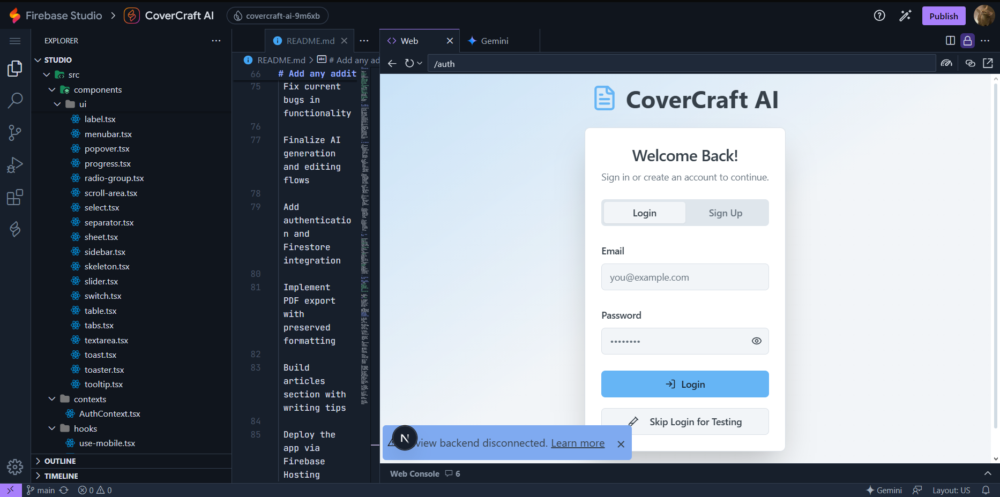
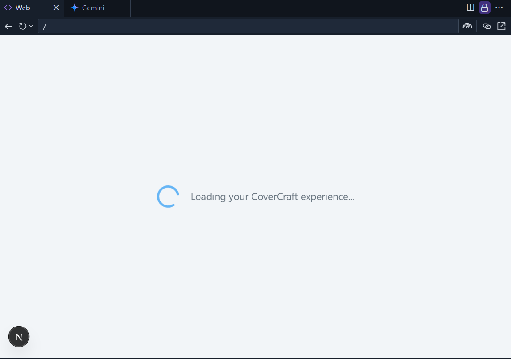
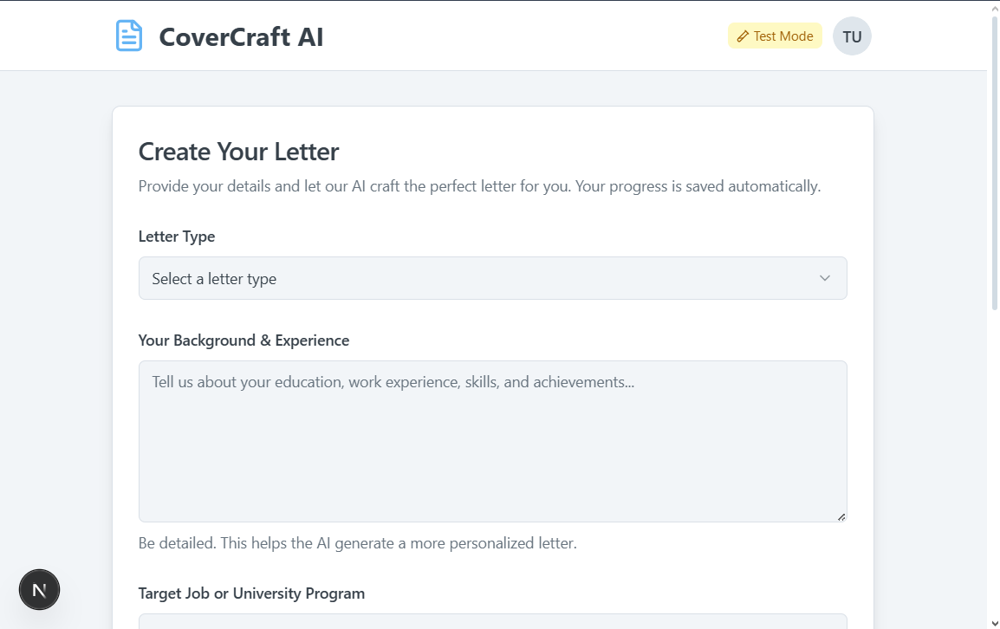
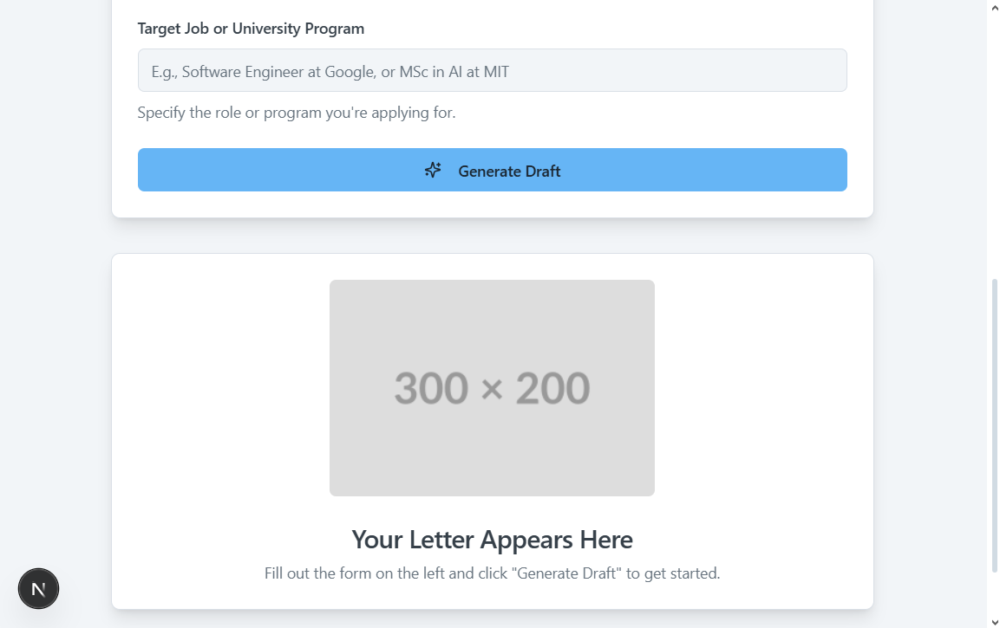
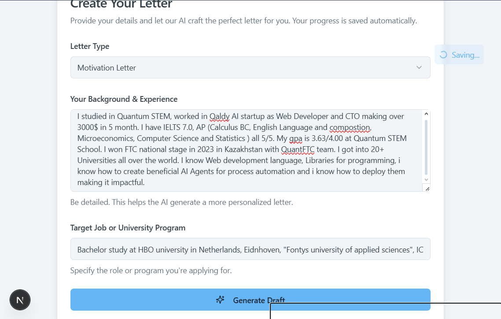

Working example:
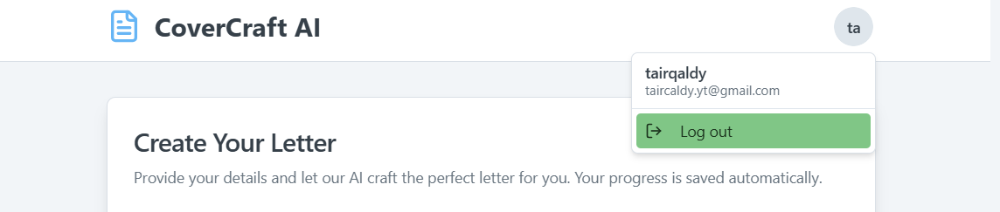
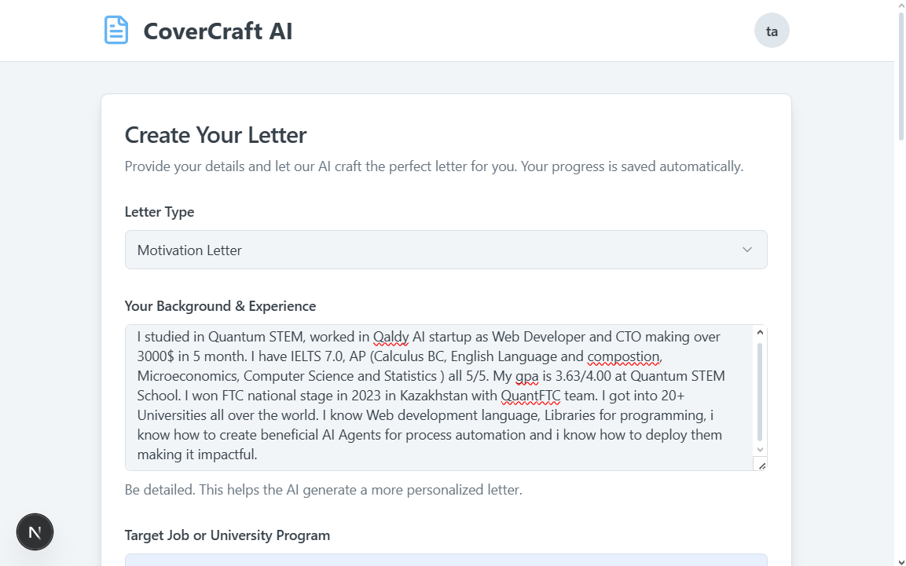
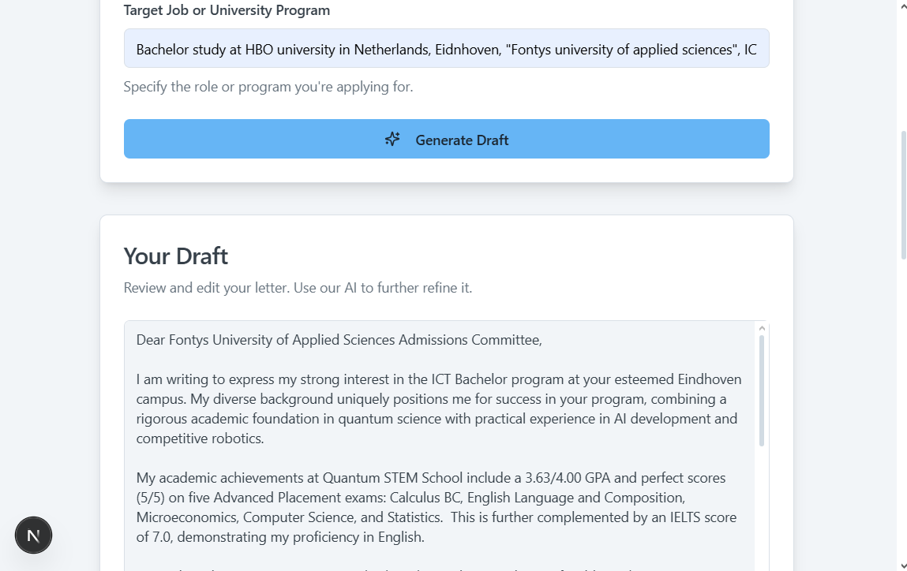
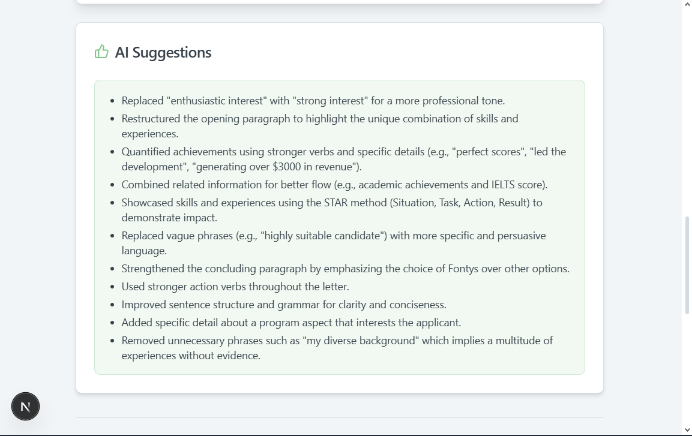
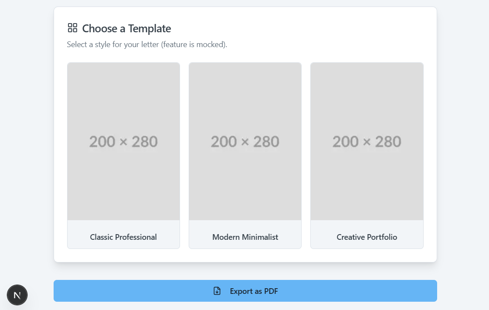
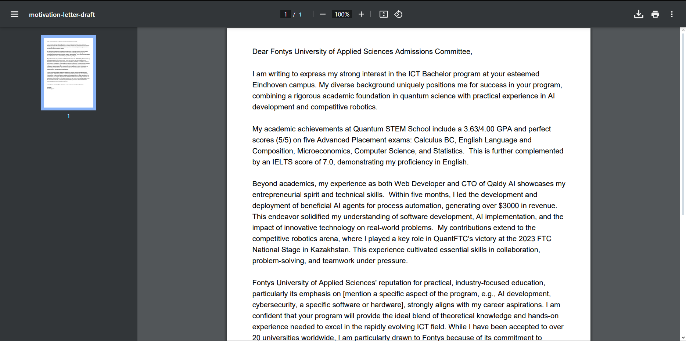
---

## 🔧 Features

- 🧠 **AI-Powered Draft Generation**  
  Generate personalized drafts using user input such as education, experience, and goals.

- ✍️ **AI Editing Support**  
  Refine your content with grammar corrections, tone improvements, and smart suggestions.

- 🎨 **Template Selection**  
  Choose from professionally designed templates to match your style and purpose.

- 📄 **PDF Export**  
  Export your final letter to a high-quality PDF for submission.

- 🔐 **Authentication** *(Planned)*  
  User registration and login using Firebase Authentication.

- ☁️ **Firestore Integration** *(Planned)*  
  Store and manage your drafts with persistent cloud storage.

- 📚 **Learning Articles Section** *(Planned)*  
  Browse articles and guides to improve your writing.

---

## 🛠️ Tech Stack

- **Frontend**: [Next.js](https://nextjs.org/), [TypeScript](https://www.typescriptlang.org/), [Tailwind CSS](https://tailwindcss.com/)
- **AI Integration**: [Genkit](https://github.com/google/genkit), Gemini API *(requires API key)*
- **Backend & Hosting**: [Firebase Studio](https://firebase.google.com/), Firebase Authentication, Firestore (coming soon)

---

## 📦 Getting Started

### 1. Clone the Repository
```bash
git clone https://github.com/tairqaldy/CoverCraft-AI.git
cd CoverCraft-AI
```

2. Install Dependencies
```bash
npm install
```
3. Configure Environment Variables
Create a .env.local file and add your API keys:

```bash```
NEXT_PUBLIC_OPENAI_API_KEY=your_openai_key
# Add any additional environment variables here
```
4. Run the Development Server
```bash
npm run dev
```
Open http://localhost:3000 in your browser to view the app.

🚧 Roadmap
 Fix current bugs in functionality

 Finalize AI generation and editing flows

 Add authentication and Firestore integration

 Implement PDF export with preserved formatting

 Build articles section with writing tips

 Deploy the app via Firebase Hosting

🤝 Contributing
Pull requests are welcome! If you’d like to contribute, fork the repository and submit a PR. For major changes, please open an issue first to discuss what you’d like to change.

📜 License
This project is licensed under the MIT License.

📬 Contact
Email: taircaldy.yt@gmail.com

GitHub: @tairqaldy

Live site: Coming soon via Firebase Studio